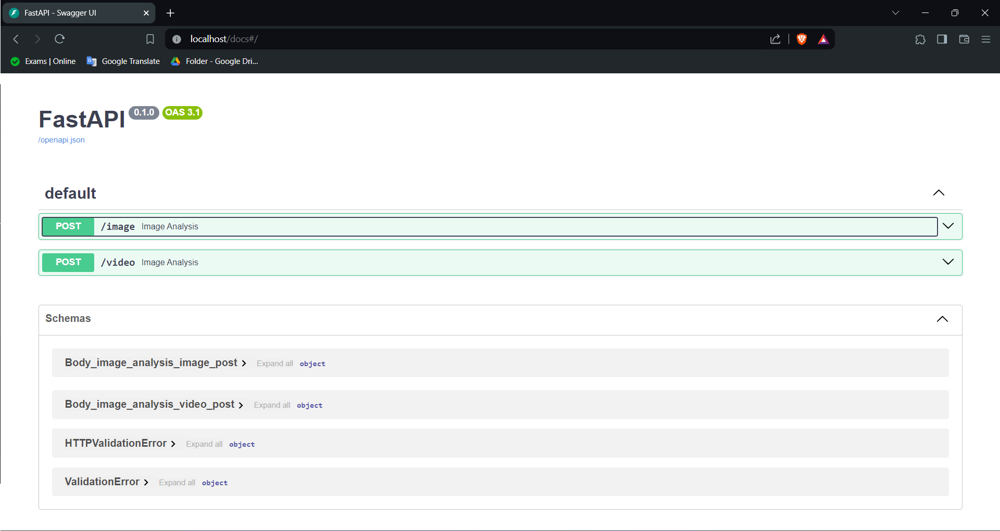

# sentiment-analysis
navigate to the working directory of this project 

for linux
```bash
cd path/to/Medical_app/
```
for windows
```bash
cd path\to\Medical_app\
```
### running docker compose
now its time to run the compose file
```bash
docker-compose up -d
```

Now you can go to http://localhost/docs

You will see the automatic interactive API documentation (provided by Swagger UI):


if you want to close the container run the following commadn

```bash
docker-compose down
```